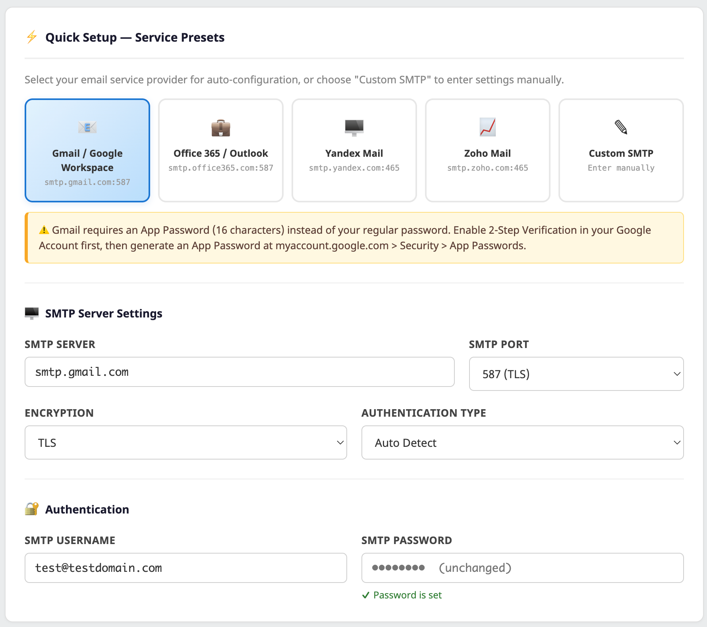
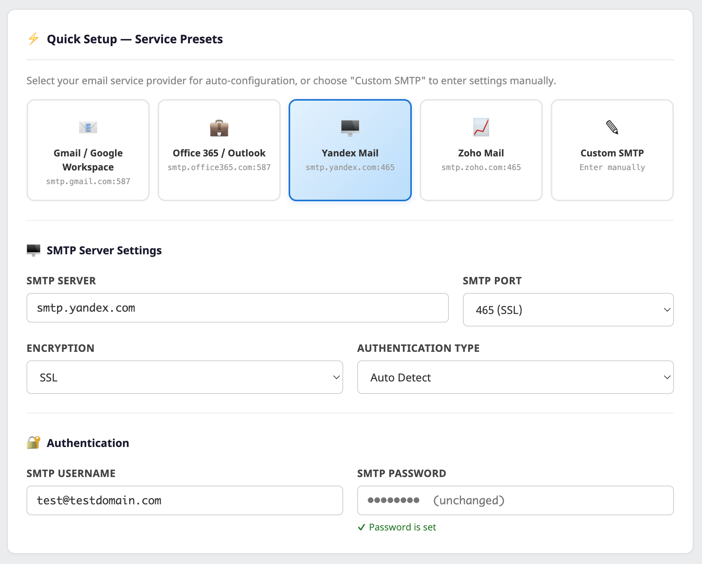

# Email Settings Plugin for OJS

Manage email delivery settings (SMTP, PHP mail, Sendmail) directly from the OJS admin panel — no need to edit `config.inc.php`.

Built for **OJS 3.3.x** by [OJS Services](https://ojs-services.com)

---

## Features

- **Per-journal SMTP configuration** — Each journal can have its own mail settings
- **Service presets** — Quick setup for Gmail, Yandex, Office 365 and more
- **Test email** — Verify your settings work before going live
- **Mail statistics** — Track emails sent today, last 7 days and last 30 days
- **Sidebar integration** — Quick access link in the OJS backend navigation
- **Role-based access** — Only Site Admins and Journal Managers can access settings (Journal Editors are restricted)
- **SMTP From address handling** — Automatic From/Reply-To rewrite for provider compatibility (Gmail, Yandex, etc.)
- **Email deliverability info** — SPF, DKIM, DMARC recommendations
- **Secure** — CSRF protection, encrypted password storage, input validation
- **Bilingual** — English and Turkish (more languages welcome via PR)
- **No core modifications** — Clean plugin architecture, safe to update OJS

## Requirements

- OJS 3.3.x
- PHP 7.3+ (PHP 8.x compatible)

## Installation

1. Download the latest release from the [Releases](https://github.com/ojs-services/OJS-email-settings-plugin/releases) page
2. Go to your OJS dashboard → **Settings** → **Website** → **Plugins** → **Upload A New Plugin**
3. Upload the `.tar.gz` file
4. Enable the plugin from the Generic Plugins list
5. Click **Settings** on the plugin, or use the **Email Settings** link in the sidebar

## Screenshots

### Settings Page — Status & Configuration

### SMTP Configuration & Service Presets

### Gmail Preset with App Password Notice

### Yandex Mail Preset

### Test Email & Deliverability Recommendations

## Configuration

### Quick Start with Presets

1. Open the plugin settings
2. Select **Use Custom Mail Settings**
3. Choose a preset (Gmail, Yandex, Office 365, etc.)
4. Enter your email and password
5. Save and send a test email

### Manual SMTP Setup

1. Select **Use Custom Mail Settings**
2. Choose **SMTP (Recommended)** as delivery method
3. Enter your SMTP server, port, encryption and credentials
4. Save and test

### Switching Back to Default

Select **Use OJS Default Configuration** and save. The system will immediately fall back to your `config.inc.php` settings.

## How It Works

The plugin hooks into the OJS mail sending process and takes full control when custom settings are active. It creates its own PHPMailer instance, configures it with your settings, and sends the email directly. When disabled or set to default, OJS behaves exactly as before.

**From address handling:** Many SMTP providers (Gmail, Yandex) reject emails when the From address doesn't match the authenticated account. The plugin automatically rewrites the From address to match your SMTP credentials and preserves the original sender as Reply-To, so replies still go to the right person.

## Changelog

### v1.3.0.0
- Mail statistics (today / 7 days / 30 days) in status banner
- Sidebar navigation link for quick access
- Role-based access control (Journal Manager vs Journal Editor distinction)
- Email deliverability recommendations (SPF/DKIM/DMARC)
- UI layout improvements

### v1.2.0.0
- Per-journal custom mail settings
- SMTP/PHP mail/Sendmail support
- Service presets (Gmail, Yandex, Office 365)
- Test email functionality
- CSRF protection and encrypted password storage
- Full hook takeover for reliable mail delivery
- From address SMTP compatibility fix
- English and Turkish localization

## Support

- **Issues:** [GitHub Issues](https://github.com/ojs-services/OJS-email-settings-plugin/issues)
- **Consulting:** [ojs-services.com](https://ojs-services.com)
- **Email:** info@ojs-services.com

## Contributing

Contributions are welcome! Feel free to submit issues, feature requests or pull requests. Translation contributions are especially appreciated.

## License

This plugin is licensed under the [GNU General Public License v3.0](LICENSE).

---

Made with ❤️ by [OJS Services](https://ojs-services.com) — Professional OJS hosting, themes, plugins and consulting for academic journals.
